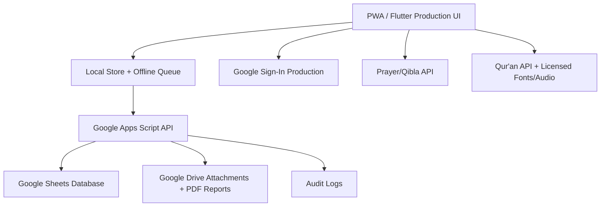

# Arsitektur

## Prinsip

- Demo berjalan tanpa kredensial.
- Produksi memakai otorisasi resmi pemilik Workspace.
- Semua data penting memiliki `family_id`, `member_id`, `id`, `created_at`, `updated_at`, dan `status_data`.
- Data ibadah privat secara default.
- Penghapusan memakai soft delete.
- Apps Script membuat struktur Sheets dan Drive secara otomatis.
